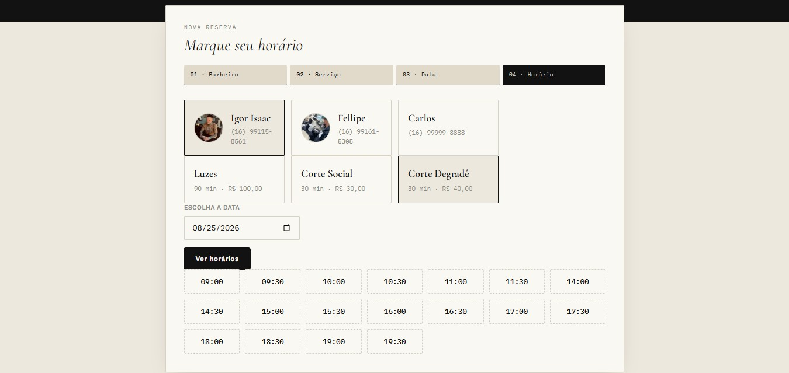
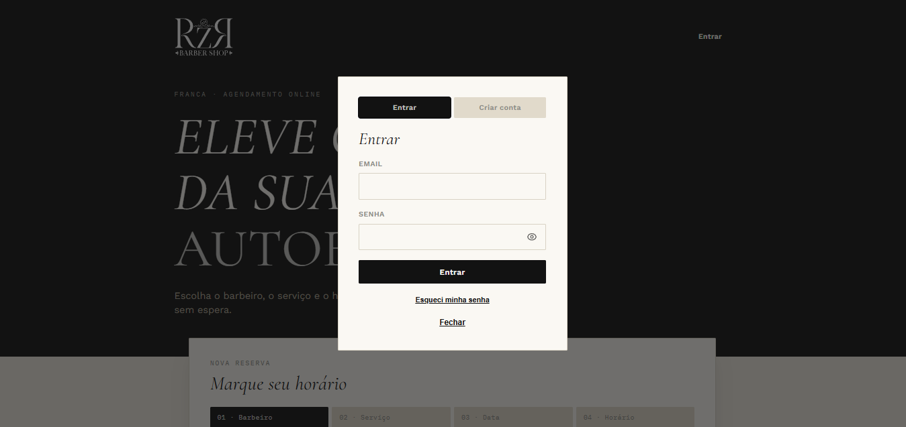
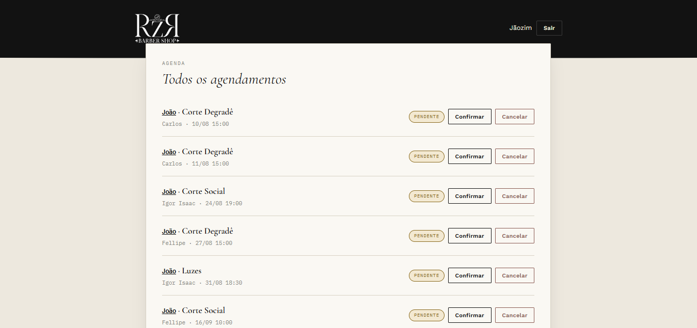

# RZR Barber Shop — Frontend

Interface web do sistema de agendamento online da RZR Barber Shop: site do cliente (agendamento, conta, LGPD) e painel administrativo completo, construídos em HTML/CSS/JavaScript puro, sem frameworks.

🔗 **Site do cliente:** [joaodanntas.github.io/barbershop-frontend](https://joaodanntas.github.io/barbershop-frontend/)

🔗 **Painel administrativo:** [joaodanntas.github.io/barbershop-frontend/admin.html](https://joaodanntas.github.io/barbershop-frontend/admin.html)

🔗 **Repositório do backend:** [barbershop-api](https://github.com/joaodanntas/barbershop-api)

---

## 📋 Sobre o projeto

Este repositório contém toda a interface do RZR Barber Shop, um sistema de agendamento online para barbearias. O frontend consome a [API REST em ASP.NET Core](https://github.com/joaodanntas/barbershop-api) hospedada no Render, e foi construído propositalmente sem frameworks (React, Vue etc.) — HTML, CSS e JavaScript puro — como exercício de fundamentos e para manter o deploy simples (arquivos estáticos no GitHub Pages).



## ✨ Funcionalidades

### Site do cliente (`index.html`)
- **Fluxo de agendamento guiado em 4 passos** — escolha de barbeiro (com foto), serviço, data e horário disponível, com atualização dinâmica de horários livres
- **Autenticação** — login, cadastro de conta e recuperação de senha por e-mail (`redefinir-senha.html`)
- **Meus agendamentos** — histórico com status (Pendente / Confirmado / Cancelado), incluindo indicação de quem cancelou (barbeiro ou cliente)
- **Cancelamento de agendamento** pelo próprio cliente
- **Páginas institucionais** — Política de Privacidade e Termos de Uso, acessíveis pelo rodapé



### Painel administrativo (`admin.html`)
- **Login restrito** a contas com perfil Admin
- **Gestão de agendamentos** — listagem paginada, confirmação e cancelamento
- **Gestão de barbeiros** — cadastro, edição, ativação/desativação e foto de perfil (upload com crop automático)
- **Gestão de serviços** — cadastro, edição, ativação/desativação, incluindo antecedência mínima para agendamento
- **Disponibilidade dos barbeiros** — horários de trabalho por dia da semana, com suporte a pausa (almoço)
- **Bloqueio de datas** — feriados globais (todos os barbeiros) ou folgas individuais
- **Log de auditoria** — histórico paginado de todas as ações administrativas (quem fez o quê e quando)



## 🛠️ Stack técnica

| Categoria | Tecnologia |
|---|---|
| Estrutura | HTML5 |
| Estilo | CSS puro (sem framework) |
| Interatividade | JavaScript vanilla (ES6+) |
| Fontes | Google Fonts (Cormorant Garamond, Work Sans, IBM Plex Mono) |
| Hospedagem | GitHub Pages |
| Backend consumido | [RZR Barber Shop API](https://github.com/joaodanntas/barbershop-api) (ASP.NET Core + PostgreSQL) |

## 📁 Estrutura de arquivos

```
barbershop-frontend/
├── index.html            # Site do cliente (agendamento, conta, meus agendamentos)
├── admin.html            # Painel administrativo
├── redefinir-senha.html  # Página de redefinição de senha (link recebido por e-mail)
├── privacidade.html      # Política de Privacidade
├── termos-uso.html       # Termos de Uso
├── app.js                # Lógica compartilhada: auth, fetch wrapper, formatadores, toasts
├── style.css             # Estilos globais (design system do site)
└── assets/
    ├── logo.svg
    ├── see-eye.svg        # Ícone de mostrar senha
    └── notsee-eye.svg     # Ícone de ocultar senha
```

## 🔌 Integração com a API

Toda a comunicação com o backend passa por uma função central em `app.js`:

```js
const API_BASE_URL = "https://barbershop-api-acij.onrender.com";

async function api(path, options = {}) { ... }
```

Ela cuida de:
- Anexar automaticamente o token JWT (quando existe) no header `Authorization`
- Tratar respostas `204 No Content`
- Detectar sessão expirada (`401` com token presente) e deslogar automaticamente
- Padronizar mensagens de erro vindas da API

> ⚠️ Como o frontend aponta direto para a API de produção, **rodar os arquivos localmente já testa contra o backend real**. Não é necessário subir o backend na sua máquina para desenvolver o frontend — mas por isso também é importante ter cuidado ao testar ações destrutivas (exclusão de conta, cancelamentos) localmente, pois elas afetam dados reais.

## 🚀 Rodando localmente

Por ser um site estático, não há build nem instalação de dependências. Basta servir os arquivos:

```bash
# Clone o repositório
git clone https://github.com/joaodanntas/barbershop-frontend.git
cd barbershop-frontend

# Sirva com qualquer servidor estático, por exemplo:
npx serve .
# ou, com a extensão Live Server do VS Code, clique com o botão direito em index.html > "Open with Live Server"
```

> O backend tem CORS liberado para `http://127.0.0.1:5500` e `http://localhost:5500` (porta padrão do Live Server) — se usar outra porta ou ferramenta, será necessário ajustar a política de CORS no backend.

## 🔒 Segurança e privacidade

- Sessão armazenada em `localStorage` (token JWT + dados básicos do usuário)
- Sanitização de conteúdo dinâmico (`escapeHtml`) antes de inserir no DOM, prevenindo XSS armazenado
- Fluxo de autoatendimento LGPD (consulta, edição e exclusão de dados pessoais) integrado ao backend
- Nenhuma credencial ou chave sensível é armazenada no frontend — toda autenticação é validada pela API

## 👤 Autor

**João Dantas**
[LinkedIn](https://linkedin.com/in/joaodanntas) · [GitHub](https://github.com/joaodanntas)

---

Projeto desenvolvido como parte da minha jornada de aprendizado em desenvolvimento web, com foco em fundamentos de HTML/CSS/JS e integração com uma API real em produção.
